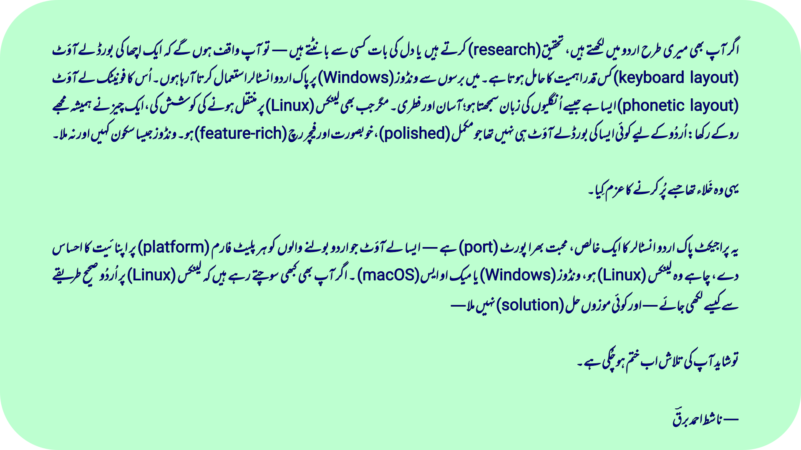

[](assets/intro_ur.png)

> As someone who regularly works in Urdu — whether writing, researching, or just chatting — I’ve always relied on Pak Urdu Installer on Windows. Its phonetic layout made typing fast, intuitive, and effortless. For years, it just worked.
>
> But every time I tried to seriously use Linux (especially on my laptop), the lack of a polished, feature-rich Urdu layout always pulled me back. No layout matched the familiarity or usability of what we had on Windows.
>
> This project is my attempt to bridge that gap.
>
> It’s a faithful port of Pak Urdu Installer, a layout that feels like home for Urdu users across  platforms: Linux, Windows, and even the macOS.
>
> If you’ve ever wanted to type Urdu properly on Linux and couldn’t find “the one,” this might be it.
>
>  — Nashit Ahmed Barq

# Pak Urdu Phonetic

**Pak Urdu Phonetic** is an Urdu keyboard layout faithfully ported from the popular Windows-based [Pak Urdu Installer](https://mbilalm.com/urdu-installer.php) layout by **mBilalm**. It offers the same simple, intuitive phonetic typing experience and brings this widely adopted standard to the Keyman platform for cross-platform use.

**With over 160+ unique key mappings** across regular, Shift, AltGr (Right Alt), and Shift+AltGr combinations, this layout offers the most complete phonetic Urdu typing solution available — more comprehensive than any previous Urdu keyboard layout to date.

## 📥 Installation Instructions and Keymap

💡 **Looking to install the keyboard or view the full keymap?**

Visit the official project page for complete step-by-step instructions and a visual layout of all key mappings:

**[barqx.github.io/pak-urdu-phonetic](https://barqx.github.io/pak-urdu-phonetic)**


## What is this?

This keyboard layout lets you type Urdu text using standard English keys in a phonetic way. For example:
- Press `A` to get `ا`
- Press `B` to get `ب` 
- Press `P` to get `پ`

It's designed specifically for Pakistani Urdu typing conventions and works exactly like the popular Windows-only Pak Urdu Installer.

## 🌟 Features

- **Phonetic Layout:** Type Urdu using English phonetic sounds
- **Keyman Compatible:** Designed specifically for Keyman implementation
- **Unicode Support:** Proper rendering of Urdu characters
- **Cross-Platform:** Works across Linux, Windows, and macOS via Keyman, with support for both physical and on-screen keyboards
- **Easy Installation:** Simple keyboard package installation

## 📱 Platform Support

| Platform | Status | Installation Method |
|----------|--------|-------------------|
| Windows 10/11 | ✅ Fully Supported | Keyman |
| Linux (Ubuntu/Debian) | ✅ Fully Supported | Keyman |
| macOS | ✅ Fully Supported | Keyman |

## 🔧 For Developers

### Building from Source

**Prerequisites:**
- [Keyman Developer](https://keyman.com/developer)
- Git

**Build Steps:**
1. Clone the repository:
   ```bash
   git clone https://github.com/nashitahmedbarq/pak-urdu-phonetic.git
   cd pak-urdu-phonetic
   ```

2. Open `pak_urdu_phonetic.kpj` in Keyman Developer

3. Press **F7** to build the project

4. Find the compiled `.kmp` file in the `build/` folder

### Project Structure

```
pak-urdu-phonetic/
├── README.md                              # Root documentation for the entire project
├── assets/                                # Repository-wide assets
│   ├── intro_ur.png
├── Keyman/                                # Keyman (Windows/macOS/Linux) keyboard layout project
│   ├── HISTORY.md                         # Keyman version history
│   ├── LICENSE.md                         # License information (MIT)
│   ├── pak_urdu_phonetic.kpj              # Keyman project file
│   └── source/                            # Keyman source files
│       ├── help/
│       │   └── pak_urdu_phonetic.php      # PHP file for Keyman site-listing
│       ├── pak_urdu_phonetic.kmn          # Main keyboard layout logic
│       ├── pak_urdu_phonetic.kps          # Keyman package definition
│       ├── pak_urdu_phonetic.kvks         # On-screen keyboard (touch)
│       ├── readme.htm                     # Installer screen readme file
│       ├── splash_screen.jpg              # Installer screen splash image
│       └── welcome/                       # Welcome screen resources
│           ├── intro_ur.png
│           ├── s1.png
│           ├── s2.png
│           ├── s3.png
│           ├── s4.png
│           └── welcome.htm               # Welcome instructions in HTML
├── XKB/                                   # XKB (Linux) keyboard layout project
│   ├── HISTORY.md                         # XKB version history
│   ├── rules/
│   │   └── base.xml                       # XKB layout listing entry
│   └── symbols/
│       └── pk                             # XKB keyboard layout logic for 'pk'

```

## 🐛 Troubleshooting

### Common Issues

**Windows:**
- **Keyman Desktop not opening**: Restart as administrator
- **Keyboard not appearing**: Check if Keyman service is running
- **Characters not typing**: Make sure keyboard is selected in Keyman Desktop

**Linux:**
- **Installation fails**: Check if you have proper permissions (`sudo` may be needed)
- **Keyboard not available**: Restart your session after installation
- **Input method not switching**: Check your desktop environment's keyboard settings

### Getting Help

If you encounter issues:
1. Check the [Issues](../../issues) section for existing solutions
2. Create a new issue with your system details
3. Include screenshots if possible

## 🤝 Contributing

We welcome contributions! Here's how you can help:

1. **Report bugs**: Found a typing issue? [Open an issue](../../issues)
2. **Suggest improvements**: Ideas for better functionality
3. **Code contributions**: Fork, improve, and submit pull requests
4. **Documentation**: Help improve this README or add tutorials

## 📜 License

MIT License - see [LICENSE](LICENSE) file for details.

**Credits:**
- Original layout: [mBilalm](https://mbilalm.com/urdu-installer.php)
- Linux port: [Nashit Ahmed Barq](https://github.com/nashitahmedbarq)

## 🙏 Acknowledgments

- **[mBilalm](https://mbilalm.com/urdu-installer.php)** for creating the original Windows Pak Urdu Installer
- **Keyman team** for providing cross-platform keyboard tools
- **Urdu computing community** for feedback and support

---

**Made with ❤️ for the Urdu computing community**
