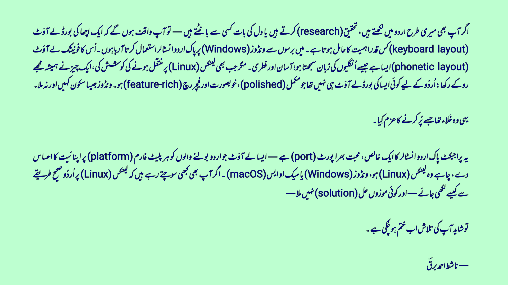
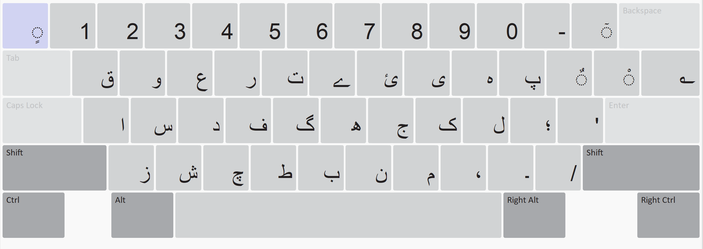

[](_assets/intro_ur.png)

> As someone who regularly works in Urdu — whether writing, researching, or just chatting — I’ve always relied on Pak Urdu Installer on Windows. Its phonetic layout made typing fast, intuitive, and effortless. For years, it just worked.
>
> But every time I tried to seriously use Linux (especially on my laptop), the lack of a polished, feature-rich Urdu layout always pulled me back. No layout matched the familiarity or usability of what we had on Windows.
>
> This project is my attempt to bridge that gap.
>
> It’s a faithful port of Pak Urdu Installer, a layout that feels like home for Urdu users across  platforms: Linux, Windows, and even the macOS.
>
> If you’ve ever wanted to type Urdu properly on Linux and couldn’t find “the one,” this might be it.
>
>  — Nashit Ahmed Barq

# Pak Urdu Phonetic

**Pak Urdu Phonetic** is an Urdu keyboard layout faithfully ported from the popular Windows-based [Pak Urdu Installer](https://mbilalm.com/urdu-installer.php) layout by **mBilalm**. It offers the same simple, intuitive phonetic typing experience and brings this widely adopted standard to the Keyman platform for cross-platform use.

**With over 160+ unique key mappings** across regular, Shift, AltGr (Right Alt), and Shift+AltGr combinations, this layout offers the most complete phonetic Urdu typing solution available — more comprehensive than any previous Urdu keyboard layout to date.


## What is this?

This keyboard layout lets you type Urdu text using standard English keys in a phonetic way. For example:
- Press `A` to get `ا`
- Press `B` to get `ب` 
- Press `P` to get `پ`

It's designed specifically for Pakistani Urdu typing conventions and works exactly like the popular Windows-only Pak Urdu Installer.

## 🌟 Features

- **Phonetic Layout:** Type Urdu using English phonetic sounds
- **Keyman Compatible:** Designed specifically for Keyman implementation
- **Unicode Support:** Proper rendering of Urdu characters
- **Cross-Platform:** Works across Linux, Windows, and macOS via Keyman, with support for both physical and on-screen keyboards
- **Easy Installation:** Simple keyboard package installation

## 📱 Platform Support

| Platform | Status | Installation Method |
|----------|--------|-------------------|
| Windows 10/11 | ✅ Fully Supported | Keyman |
| Linux (Ubuntu/Debian) | ✅ Fully Supported | Keyman |
| macOS | ✅ Fully Supported | Keyman |

## 📥 Installation Instructions

### 🐧 For Linux Users

**Ubuntu/Debian:**
```bash
sudo add-apt-repository ppa:keymanapp/keyman
sudo apt update
sudo apt install keyman
```

**Other distributions:** Download from [keyman.com/linux](https://keyman.com/linux)

### Install Urdu Keyboard

1. Download `pak_urdu_phonetic.kmp` from [Releases](../../releases)
2. Double-click the `.kmp` file (it should open in Keyman)
3. Click "Install" when prompted

### Use the Keyboard

- Look for the Keyman icon in your taskbar
- Click it to switch between keyboards
- Select "Pak Urdu" to type in Urdu

### 🪟 For Windows Users

**Prerequisites:**
- Download and install [Keyman Desktop](https://keyman.com/desktop/) first

**Installation Steps:**
1. Download the latest `pak_urdu_phonetic.kmp` file from the [Releases](../../releases) section
2. Double-click the downloaded `.kmp` file
3. Keyman Desktop will open and ask for confirmation - click "Install"
4. The keyboard will be automatically added to your system

**To activate:**
1. Click the Keyman Desktop icon in your system tray
2. Select "Pak Urdu Phonetic" from the keyboard list
3. Start typing in any application

### 🍎 macOS

> **Prerequisites:** Install [Keyman for macOS](https://keyman.com/mac/) first

1. 📦 Download `pak_urdu_phonetic.kmp` from from [Releases](../../releases)
2. 🖱️ **Double-click** the `.kmp` file
3. ✅ Click **"Install"** when Keyman prompts
4. 🎉 Ready to type!

**To activate:**
- Click the Keyman icon in your menu bar
- Select "Pak Urdu Phonetic"
- Start typing in any application

That's it! Start typing in any app.

## Pak Urdu Phonetic - Keyboard Layout Mapping

### Regular Keys

[](_assets/s1.png)

| Key | Character | Unicode |
|-----|-----------|---------|
| 0 | 0 | U+0030 |
| 1 | 1 | U+0031 |
| 2 | 2 | U+0032 |
| 3 | 3 | U+0033 |
| 4 | 4 | U+0034 |
| 5 | 5 | U+0035 |
| 6 | 6 | U+0036 |
| 7 | 7 | U+0037 |
| 8 | 8 | U+0038 |
| 9 | 9 | U+0039 |
| A | ا | U+0627 |
| B | ب | U+0628 |
| C | چ | U+0686 |
| D | د | U+062F |
| E | ع | U+0639 |
| F | ف | U+0641 |
| G | گ | U+06AF |
| H | ھ | U+06BE |
| I | ی | U+06CC |
| J | ج | U+062C |
| K | ک | U+06A9 |
| L | ل | U+0644 |
| M | م | U+0645 |
| N | ن | U+0646 |
| O | ہ | U+06C1 |
| P | پ | U+067E |
| Q | ق | U+0642 |
| R | ر | U+0631 |
| S | س | U+0633 |
| T | ت | U+062A |
| U | ئ | U+0626 |
| V | ط | U+0637 |
| W | و | U+0648 |
| X | ش | U+0634 |
| Y | ے | U+06D2 |
| Z | ز | U+0632 |
| ` | ٍ | U+064D |
| \ | ؎ | U+060E |
| ; | ؛ | U+061B |
| , | ، | U+060C |
| = | ٓ | U+0653 |
| - | - | U+002D |
| [ | ٌ | U+064C |
| . | ۔ | U+06D4 |
| ' | ' | U+0027 |
| ] | ْ | U+0652 |
| / | / | U+002F |

### Shift Keys

[](_assets/s2.png)

| Key | Character | Unicode |
|-----|-----------|---------|
| 0 | ( | U+0028 |
| 1 | ! | U+0021 |
| 2 | @ | U+0040 |
| 3 | # | U+0023 |
| 4 | $ | U+0024 |
| 5 | ٪ | U+066A |
| 6 | ۂ | U+06C2 |
| 7 | & | U+0026 |
| 8 | ٭ | U+066D |
| 9 | ) | U+0029 |
| A | آ | U+0622 |
| B | ﷽ | U+FDFD |
| C | ث | U+062B |
| D | ڈ | U+0688 |
| E | ؑ | U+0611 |
| F | ٖ | U+0656 |
| G | غ | U+063A |
| H | ح | U+062D |
| I | ٰ | U+0670 |
| J | ض | U+0636 |
| K | خ | U+062E |
| L | ؒ | U+0612 |
| M | ؐ | U+0610 |
| N | ں | U+06BA |
| O | ۃ | U+06C3 |
| P | ُ | U+064F |
| Q | ﷺ | U+FDFA |
| R | ڑ | U+0691 |
| S | ص | U+0635 |
| T | ٹ | U+0679 |
| U | ء | U+0621 |
| V | ظ | U+0638 |
| W | ؤ | U+0624 |
| X | ژ | U+0698 |
| Y | ۓ | U+06D3 |
| Z | ذ | U+0630 |
| ` | ً | U+064B |
| \ | ؔ | U+0614 |
| ; | : | U+003A |
| , | ِ | U+0650 |
| = | ۤ | U+06E4 |
| - | ـ | U+0640 |
| [ | ٗ | U+0657 |
| . | َ | U+064E |
| ' | " | U+0022 |
| ] | ّ | U+0651 |

### AltGr (Right Alt) Keys

[](_assets/s3.png)

| Key | Character | Unicode |
|-----|-----------|---------|
| 0 | ۰ | U+06F0 |
| 1 | ۱ | U+06F1 |
| 2 | ۲ | U+06F2 |
| 3 | ۳ | U+06F3 |
| 4 | ۴ | U+06F4 |
| 5 | ۵ | U+06F5 |
| 6 | ۶ | U+06F6 |
| 7 | ۷ | U+06F7 |
| 8 | ۸ | U+06F8 |
| 9 | ۹ | U+06F9 |
| A | أ | U+0623 |
| C | ۣ | U+06E3 |
| E | ۠ | U+06E0 |
| I | ي | U+064A |
| J | ۚ | U+06DA |
| K | ك | U+0643 |
| L | ۙ | U+06D9 |
| M | ۘ | U+06D8 |
| N | ۨ | U+06E8 |
| O | ه | U+0647 |
| Q | ۥ | U+06E5 |
| R | ؓ | U+0613 |
| S | ۜ | U+06DC |
| T | ‌‌‌ZERO WIDTH NON-JOINER (ZWNJ) | U+200C |
| U | ٔ | U+0654 |
| V | ؕ | U+0615 |
| W | ‍‌‌ZERO WIDTH JOINER (ZWJ) | U+200D |
| Y | ؁ | U+0601 |
| Z | ۡ | U+06E1 |
| ` | ۤ | U+06E4 |
| \ | ؏ | U+060F |
| ; | “ | U+201C |
| , | ۫ | U+06EB |
| = | ؂ | U+0602 |
| - | ؀ | U+0600 |
| [ | ۩ | U+06E9 |
| . | ۯ | U+06EF |
| ' | ” | U+201D |
| ] | ٘ | U+0658 |

### AltGr + Shift Keys

[](_assets/s4.png)

| Key | Character | Unicode |
|-----|-----------|---------|
| 0 | ﴿ | U+FD3F |
| 1 | ٱ | U+0671 |
| 5 | ۬ | U+06EC |
| 6 | ۮ | U+06EE |
| 7 | ۧ | U+06E7 |
| 8 | ۞ | U+06DE |
| 9 | ﴾ | U+FD3E |
| A | إ | U+0625 |
| E | علیہ السلام | U+0639 U+0644 U+06CC U+06C1 U+0020 U+0627 U+0644 U+0633 U+0644 U+0627 U+0645 |
| I | ى | U+0649 |
| J | ۭ | U+06ED |
| L | رحمۃ اللہ علیہ | U+0631 U+062D U+0645 U+06C3 U+0020 U+0627 U+0644 U+0644 U+06C1 U+0020 U+0639 U+0644 U+06CC U+06C1 |
| M | ۢ | U+06E2 |
| N | ۿ | U+06FF |
| O | ة | U+0629 |
| P | ۗ | U+06D7 |
| Q | ڪ | U+06AA |
| R | رضی اللہ عنہ | U+0631 U+0636 U+06CC U+0020 U+0627 U+0644 U+0644 U+06C1 U+0020 U+0639 U+0646 U+06C1 |
| S | ۪ | U+06EA |
| U | ٕ | U+0655 |
| W | ۥ | U+06E5 |
| X | ﷻ | U+FDFB |
| Y | ۦ | U+06E6 |
| ` | . | U+002E |
| \ | ؃ | U+0603 |
| ; | ‘ | U+2018 |
| , | ؍ | U+060D |
| [ | ۖ | U+06D6 |
| . | ۝ | U+06DD |
| ' | ’ | U+2019 |
| / | ۛ | U+06DB |

- **Total mappings:** 164
- **Total physical keys (K_):** 47
- **Total key + modifier combos:** 163

## 🔧 For Developers

### Building from Source

**Prerequisites:**
- [Keyman Developer](https://keyman.com/developer)
- Git

**Build Steps:**
1. Clone the repository:
   ```bash
   git clone https://github.com/nashitahmedbarq/pak-urdu-phonetic.git
   cd pak-urdu-phonetic
   ```

2. Open `pak_urdu_phonetic.kpj` in Keyman Developer

3. Press **F7** to build the project

4. Find the compiled `.kmp` file in the `build/` folder

### Project Structure

```
pak-urdu-phonetic/
├── README.md                              # Root documentation for the entire project
├── _assets/                                # Repository-wide assets
│   ├── intro_ur.png
│   ├── s1.png
│   ├── s2.png
│   ├── s3.png
│   └── s4.png
├── Keyman/                                # Keyman (Windows/macOS/Linux) keyboard layout project
│   ├── HISTORY.md                         # Keyman version history
│   ├── LICENSE.md                         # License information (MIT)
│   ├── pak_urdu_phonetic.kpj              # Keyman project file
│   └── source/                            # Keyman source files
│       ├── help/
│       │   └── pak_urdu_phonetic.php      # PHP file for Keyman site-listing
│       ├── pak_urdu_phonetic.kmn          # Main keyboard layout logic
│       ├── pak_urdu_phonetic.kps          # Keyman package definition
│       ├── pak_urdu_phonetic.kvk          # On-screen keyboard (desktop)
│       ├── pak_urdu_phonetic.kvks         # On-screen keyboard (touch)
│       ├── readme.htm                     # Installer screen readme file
│       ├── splash_screen.jpg              # Installer screen splash image
│       └── welcome/                       # Welcome screen resources
│           ├── intro_ur.png
│           ├── s1.png
│           ├── s2.png
│           ├── s3.png
│           ├── s4.png
│           └── welcome.htm               # Welcome instructions in HTML
├── XKB/                                   # XKB (Linux) keyboard layout project
│   ├── HISTORY.md                         # XKB version history
│   ├── rules/
│   │   └── base.xml                       # XKB layout listing entry
│   └── symbols/
│       └── pk                             # XKB keyboard layout logic for 'pk'

```

## 🐛 Troubleshooting

### Common Issues

**Windows:**
- **Keyman Desktop not opening**: Restart as administrator
- **Keyboard not appearing**: Check if Keyman service is running
- **Characters not typing**: Make sure keyboard is selected in Keyman Desktop

**Linux:**
- **Installation fails**: Check if you have proper permissions (`sudo` may be needed)
- **Keyboard not available**: Restart your session after installation
- **Input method not switching**: Check your desktop environment's keyboard settings

### Getting Help

If you encounter issues:
1. Check the [Issues](../../issues) section for existing solutions
2. Create a new issue with your system details
3. Include screenshots if possible

## 🤝 Contributing

We welcome contributions! Here's how you can help:

1. **Report bugs**: Found a typing issue? [Open an issue](../../issues)
2. **Suggest improvements**: Ideas for better functionality
3. **Code contributions**: Fork, improve, and submit pull requests
4. **Documentation**: Help improve this README or add tutorials

## 📜 License

MIT License - see [LICENSE](LICENSE) file for details.

**Credits:**
- Original layout: [mBilalm](https://mbilalm.com/urdu-installer.php)
- Linux port: [Nashit Ahmed Barq](https://github.com/nashitahmedbarq)

## 🙏 Acknowledgments

- **[mBilalm](https://mbilalm.com/urdu-installer.php)** for creating the original Windows Pak Urdu Installer
- **Keyman team** for providing cross-platform keyboard tools
- **Urdu computing community** for feedback and support

---

**Made with ❤️ for the Urdu computing community**
